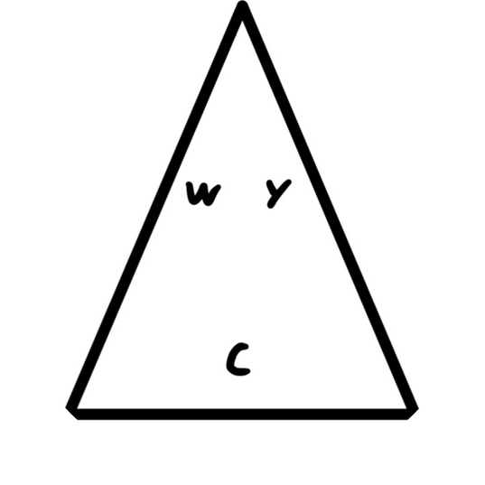

#  WAYC

기간<br/>
2022.09 - 2023.11, 2023.09 - 현재


### 👥  참여인원
- 가천대학교 컴퓨터공학과 권오현 [Github](https://github.com/5hyun) | qhslsl@gmail.com

- 가천대학교 컴퓨터공학과 추성준 [Github](https://github.com/ChuSeongJun) | j949854@gmail.com

## 🎯 기술 스택
npm<br/>
webpack<br/>
React<br/>
TypeScript<br/>
Redux Toolkit<br/>
Rtk Query<br/>
Emotion JS<br/>
MSW

## 💻 프로젝트 실행 방법

```shell
git@github.com:why-are-you-c0ding/project-frontend.git
cd project-frontend
npm i
npm run dev
```

## ❓ WAYC 프로젝트 소개
1. [메인페이지](#메인페이지)
2. [회원가입](#회원가입)
3. [로그인](#로그인)
4. [판매자 페이지](#판매자-페이지)
   - [등록 상품 조회 페이지](#등록-상품-조회-페이지)
   - [상품(재고) 관리 페이지](#상품(재고)-관리-페이지)
   - [판매 내역 조회 페이지](#판매-내역-조회-페이지)
   - [상품 등록 페이지](#상품-등록-페이지)
5. [구매자 상품 관련 페이지](#구매자-상품-관련-페이지)
   - [전체 상품 조회 페이지](#전체-상품-조회-페이지)
   - [상품 검색 페이지](#상품-검색-페이지)
   - [상품 상세 조회 페이지](#상품-상세-조회-페이지)
   - [상품 결제 정보 입력 페이지](#상품-결제-정보-입력-페이지)
   - [결제 페이지](#결제-페이지)
6. [구매자 마이페이지](#구매자-마이페이지)
   - [주문 내역 조회 페이지](#주문-내역-조회-페이지)
   - [장바구니 페이지](#장바구니-페이지)

<br/>

## 메인페이지
<video src="https://github.com/why-are-you-c0ding/project-frontend/assets/86971770/9f0782d6-03c9-4595-a283-6a0528e361db"></video>

- 배너 이미지를 통해 상품을 홍보합니다.
- 현재는 배너에 강아지 사진을 임시로 사용하고 있습니다.
- 전체 상품 조회도 가능합니다.
- 전체 상품 조회의 상세 설명은 "전체 상품 조회 페이지" 부분에 있습니다.

---

## 회원가입


- 판매자, 구매자 모두 이 페이지에서 회원가입이 가능합니다.
- 판매자로 회원가입을 하려면 하단에 "판매자로 가입하기"를 체크하면 판매자로 회원가입이 가능합니다.
---


## 로그인


- 회원가입 후, 로그인을 할 수 있습니다.
---

## 판매자 페이지

### 등록 상품 조회 페이지
<video src="https://github.com/why-are-you-c0ding/project-frontend/assets/86971770/2aff7e34-82e4-45c1-b85b-8f1e621c37d3"></video>

- 판매자가 등록한 상품을 조회할 수 있는 페이지 입니다.
- 상품 관리 버튼을 누르면 상품(재고) 관리 페이지로 이동합니다.

### 상품(재고) 관리 페이지
<video src="https://github.com/why-are-you-c0ding/project-frontend/assets/86971770/327ba9a5-0591-4cd1-b4b5-c7ea7ab6a829"></video>

- 판매자가 등록한 상품의 재고를 관리할 수 있는 페이지 입니다.
- "재고 수정" 버튼을 클릭하면 재고 수정이 가능합니다.
- "재고 일괄 수정" 버튼을 클릭하면 모든 상품의 재고를 일괄 수정할 수 있습니다.
- MSW로 구축된 상태여서 재고 수정 시 모든 재고의 수가 변경됩니다.

### 판매 내역 조회 페이지

- 구현 중

### 상품 등록 페이지
<video src="https://github.com/why-are-you-c0ding/project-frontend/assets/86971770/d24b40f5-5f00-4ba3-a125-5deb747c995c"></video>

- 판매자가 상품을 등록할 수 있는 페이지 입니다.
- 상품 이미지와 옵션 정보를 설정 할 수 있습니다.
- MSW로 구축된 상태여서 상품 등록 반영이 바로 되지 않습니다.

---

## 구매자 상품 관련 페이지

### 전체 상품 조회 페이지


- 메인 페이지에서 전체 상품을 조회할 수 있습니다.
- 무한 스크롤을 이용하여 구현하였습니다.
- 무한 스크롤에서는 react-intersection-observer를 사용하였습니다.
- 또한 RTK Query의 캐싱 기능을 사용하여 구현하였습니다.
- 오른쪽 하단에 "TOP" 버튼을 누르면 최상단으로 올라가게 하였습니다.

### 상품 검색 페이지
데스크톱<br>


반응형<br>


- 상단바의 검색 부분에 상품을 검색하면 상품이 나오는 페이지 입니다.
- 메인에서의 전체 상품 조회처럼 무한 스크롤 방식을 사용했습니다.

### 상품 상세 조회 페이지
데스크톱<br>


반응형<br>


- 전체 상품 조회에서 상품을 클릭하면 상품 상세 조회 페이지로 이동합니다.
- 상품의 옵션과 수량 선택이 가능합니다.
- 장바구니에 상품 등록도 가능합니다.

### 상품 결제 정보 입력 페이지
데스크톱<br>


반응형<br>


- 상품 상세 조회 페이지에서 "구매" 버튼을 누르면 나오는 페이지입니다.
- 구매자의 주소를 입력하고 상품 결제가 가능합니다.

### 결제 페이지

- 구현 중
---

## 구매자 마이페이지
데스크톱<br>


- 구현 중


### 주문 내역 조회 페이지

- 구현 중
### 장바구니 페이지
데스크톱<br>


반응형<br>


- 구매자가 장바구니에 넣은 상품들을 볼 수 있는 페이지입니다.
- 전체 선택 체크박스를 누르면 전체 선택이 가능합니다.
- "구매하기" 버튼을 클릭하면 구매 페이지로 넘어갑니다.
- "구매하기" 버튼을 클릭하였을 때 선택된 상품이 존재하지 않으면 에러 메시지를 보여줍니다.
